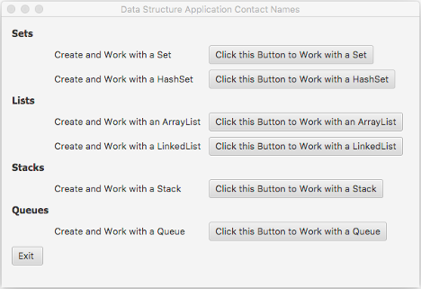

# Java-Data-Structure
Creating a Data Structure information system that holds a collection of contact names and their corresponding numerical phone numbers using GUI, Data Structures, and inheritance.

